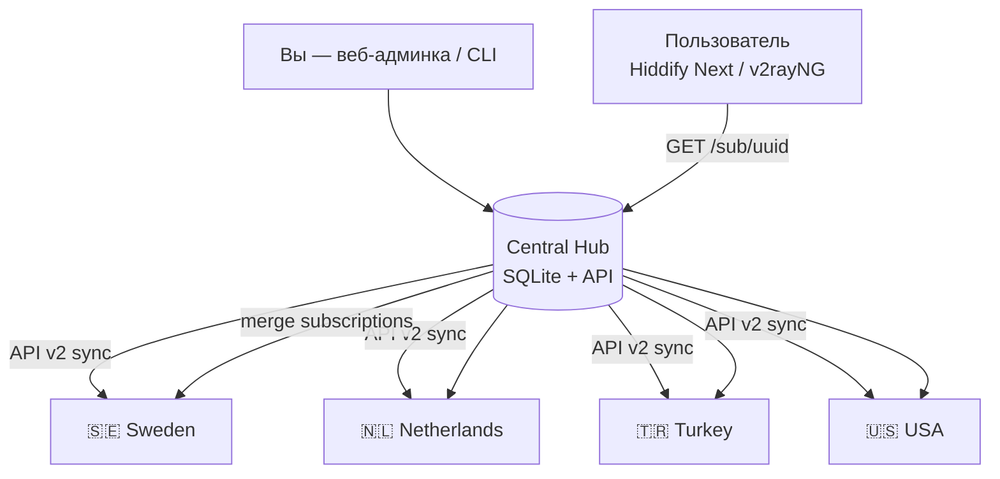

# Hiddify Central Hub

Централизованная админка для **10+ серверов Hiddify Manager**: одна точка продления подписок, доступ пользователей ко **всем странам**, автоматический failover через единую subscription-ссылку, бэкап и восстановление на любом IP.

---

## Что вы получите

| Задача | Решение |
|--------|---------|
| Один кабинет для продления | Web-админка + CLI `hiddify-hub renew-user` |
| Доступ к NL, TR, US, SE и др. | Один UUID синхронизируется на все ноды |
| Падение одного сервера | Агрегатор подписки отдаёт конфиги только с живых нод |
| Бэкап и перенос | `hiddify-hub backup` / `restore` + скрипт восстановления |

---

## Архитектура



**Ключевая идея:** у каждого пользователя **один UUID на всех серверах**. Клиент получает **одну subscription-ссылку** вида:

```
https://hub.example.com/sub/{uuid}
```

Хаб собирает конфиги со всех здоровых нод и отдаёт объединённую подписку. Если упал шведский сервер — в подписке остаются NL, TR, US; клиент переключается сам (auto-select в Hiddify Next).

---

## План действий (пошагово)

### Этап 0 — Подготовка (1–2 часа)

1. **Выберите центральный сервер для Hub** — отдельный VPS (можно самый дешёвый) или один из существующих. Главное: стабильный домен, например `hub.yourdomain.com`.
2. **Зарегистрируйте домены** для каждой страны (или поддомены): `se.`, `nl.`, `tr.`, `us.` и т.д.
3. **Обновите Hiddify** на всех нодах до одной версии (рекомендуется последняя stable).
4. На **каждой** ноде включите API: `Admin Panel → Settings → API`, сохраните:
   - `Hiddify-API-Key` (UUID админа)
   - `Admin Proxy Path` (Settings → Advanced Settings)

### Этап 1 — Развернуть ноды по странам

Сейчас у вас ~10 серверов в Швеции. Целевая схема:

| Нода | Страна | Роль |
|------|--------|------|
| se-1, se-2 | Sweden | Основной трафик EU |
| nl-1 | Netherlands | EU альтернатива |
| tr-1 | Turkey | Ближний Восток |
| us-1 | USA | Америка |
| … | … | Резерв / масштабирование |

На **каждом** сервере — полноценный Hiddify Manager (как сейчас). Протоколы: VLESS Reality + Hysteria2 (рекомендуется).

> **Встроенная функция Hiddify «Central panel (multi server)»**  
> В Advanced Settings можно подключить worker-ноды к центральной панели Hiddify. Это полезно для учёта трафика, но **ещё не полноценный кластер** (см. [issue #5192](https://github.com/hiddify/Hiddify-Manager/issues/5192)).  
> **Этот Hub** дополняет/заменяет ручное управление: единая subscription, бэкап, продление через одну админку.

### Этап 2 — Установить Central Hub

```bash
cd hiddify-central-hub
cp config/servers.example.yaml config/servers.yaml
# отредактируйте config/servers.yaml — все ваши ноды
chmod +x scripts/*.sh
./scripts/install.sh
hiddify-hub health
hiddify-hub serve
```

Или через Docker:

```bash
cp config/servers.example.yaml config/servers.yaml
docker compose up -d --build
```

Откройте `http://ВАШ_IP:8080`, войдите паролем из `hub.admin_password`.

### Этап 3 — Миграция существующих пользователей

Если все пользователи сейчас на одном шведском сервере:

```bash
./scripts/migrate-from-single-server.sh se-1
```

Скрипт:
1. Импортирует пользователей с `se-1` в Hub
2. Создаёт/обновляет их на всех остальных нодах с **тем же UUID**
3. Проверяет health всех серверов

**Выдайте пользователям новую ссылку:**

```
https://hub.yourdomain.com/sub/{uuid}
```

Старую односерверную subscription можно оставить временно для плавного перехода.

### Этап 4 — Ежедневная работа

| Действие | Команда / UI |
|----------|----------------|
| Продлить подписку | Админка → «Продлить» или `hiddify-hub renew-user UUID --days 30` |
| Новый пользователь | Админка → «Создать» или `hiddify-hub create-user "Иван"` |
| Синхронизация после сбоя | `hiddify-hub sync-all` |
| Проверка серверов | `hiddify-hub health` |
| Бэкап | `hiddify-hub backup data/backups/hub-$(date +%F).tar.gz` |

### Этап 5 — Бэкап и восстановление на новом IP

**Регулярный бэкап (cron, раз в день):**

```bash
0 3 * * * cd /opt/hiddify-central-hub && hiddify-hub backup /backups/hub-$(date +\%F).tar.gz --encrypt "ваш-секрет"
```

**Восстановление на новом сервере:**

```bash
git clone .../hiddify-central-hub
./scripts/restore-on-new-server.sh /path/to/backup.tar.gz "ваш-секрет"
# обновите public_url и base_url нод в config/servers.yaml
hiddify-hub sync-all
hiddify-hub serve
```

Бэкап содержит: всех пользователей, статус синхронизации нод, полный `servers.yaml`.

### Этап 6 — Failover для пользователей

1. В **Hiddify Next** включите **Auto Select** — клиент сам выберет fastest/рабочий сервер.
2. Hub каждые 2 минуты проверяет ноды; мёртвые **исключаются** из `/sub/{uuid}`.
3. При падении SE пользователи автоматически видят NL/TR/US в подписке.

---

## Конфигурация `config/servers.yaml`

```yaml
hub:
  admin_password: "strong-password"
  public_url: "https://hub.yourdomain.com"
  listen_port: 8080
  auto_apply_users: true   # SSH apply-users после изменений (важно для Hy2/TUIC)

nodes:
  - id: nl-1
    name: "Netherlands #1"
    country: NL
    base_url: "https://nl.yourdomain.com"
    admin_proxy_path: "abc123"
    api_key: "admin-uuid"
    user_proxy_path: "xyz789"
    ssh:                      # опционально, для apply-users
      host: "1.2.3.4"
      user: root
      key_path: "~/.ssh/id_rsa"
```

Полный пример: [`config/servers.example.yaml`](config/servers.example.yaml).

---

## CLI

```bash
hiddify-hub health
hiddify-hub list-users
hiddify-hub create-user "Maria" --days 30 --gb 100
hiddify-hub renew-user UUID --days 30
hiddify-hub disable-user UUID
hiddify-hub sync-all
hiddify-hub import-from-node se-1
hiddify-hub subscription-url UUID
hiddify-hub backup backup.tar.gz --encrypt "secret"
hiddify-hub restore backup.tar.gz --encrypt "secret"
hiddify-hub serve
```

---

## Важные нюансы Hiddify API

1. **После API-изменений** протоколы Hy2/TUIC/Mieru/Naive могут не обновиться сразу ([issue #5505](https://github.com/hiddify/Hiddify-Manager/issues/5505)). Hub при `auto_apply_users: true` выполняет по SSH:
   ```bash
   /opt/hiddify-manager/common/commander.py apply-users
   systemctl restart hiddify-singbox
   ```
2. **Один UUID** — обязателен для сквозной подписки. Hub задаёт UUID при создании и синхронизирует его на все ноды.
3. **Subscription URL на ноде** — проверьте формат в панели пользователя и укажите правильный `user_proxy_path`.

---

## Reverse proxy (рекомендуется)

Поставьте Nginx/Caddy перед Hub:

```nginx
server {
    listen 443 ssl;
    server_name hub.yourdomain.com;
    location / {
        proxy_pass http://127.0.0.1:8080;
        proxy_set_header Host $host;
    }
}
```

---

## Структура проекта

```
hiddify-central-hub/
├── config/servers.example.yaml
├── scripts/
│   ├── install.sh
│   ├── migrate-from-single-server.sh
│   └── restore-on-new-server.sh
├── src/hiddify_hub/
│   ├── api_client.py      # Hiddify API v2
│   ├── sync.py            # синхронизация пользователей + агрегатор
│   ├── backup.py          # бэкап/restore
│   ├── web.py             # админка + /sub/{uuid}
│   └── cli.py
├── docker-compose.yml
└── README.md
```

---

## FAQ

**Можно ли не ставить отдельный Hub, а использовать только Hiddify Central Panel?**  
Можно частично — для создания пользователей на worker-нодах. Но единая subscription, централизованный бэкап и перенос на новый IP Hub закрывает надёжнее.

**Нужно ли менять клиент пользователям?**  
Достаточно заменить subscription-ссылку на `https://hub.../sub/{uuid}`.

**Как добавить 11-й сервер?**  
Добавьте блок в `servers.yaml`, выполните `hiddify-hub sync-all`.

---

## Лицензия

MIT — используйте свободно для личных и коммерческих проектов.
